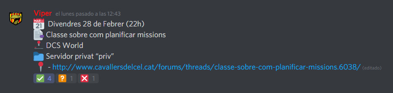

# Pas 10: La primera missió

Un cop superat el CPB se't donarà accés als canals privats del DCS del servidor de Discord i podràs apuntar-te a les missions del grup. Per fer-ho, has de consultar el canal `#dcs-missions`.

Al final de tot, veuràs les missions programades per als següents dies. Per marcar la teva assisència has de *reaccionar* al missatge.

{: .center}

* `Vist verd`: Assisteixo.
* `Interrogant`: Sóc dubte, encara no ho se segur.
* `Creu vermella`: No podré venir.

!!! danger "Important"

	Si no t'apuntes a una missió (encara que sigui per dir que no podràs venir), es considerarà una falta de compromís. A més, és probable que no se't comptabilitzi i fins i tot que no tinguis lloc. Per això el personal del grup et recomanem que revisis aquest apartat cada dos o tres dies, com a mínim.

Un cop arribi el dia de la missió: has d'entrar 15 minuts abans al TeamSpeak 3, repassar que tinguis tot actualitzat i que l'SRS funcioni. Si tens algun dubte, pots preguntar als companys abans d'entrar.

[Següent pas >](/gn/pilot)
