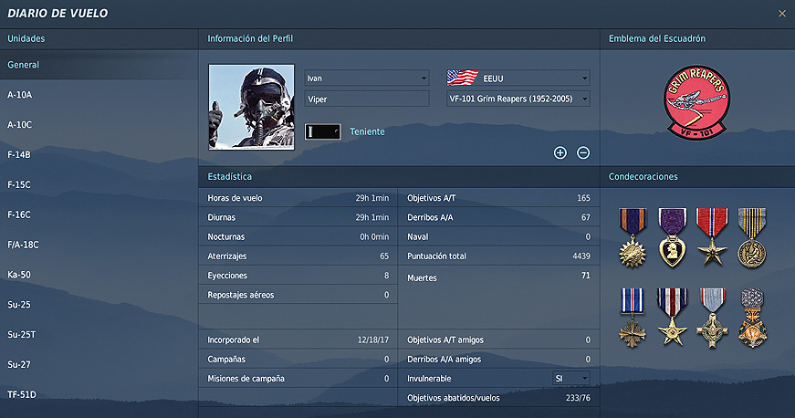

# Pas 5: Diari de vol

Obre el DCS.

Dins el menú principal del simulador, ves al botó Diari de vol que hi ha a la
dreta.

{: .center}

Escriu el teu nick, el teu nom real, selecciona una imatge del pilot, i l'emblema que més t'agradi del llistat.

!!! danger "Important"

	Assegura't que tens marcada la casella **Invulnerable**.

Aquí podràs veure un resum del teu pilot al DCS. Tingues en compte que això pertany a tota l'activitat al simulador, no exclusivament la del grup DCS.

[Següent pas >](/gn/pas6)
