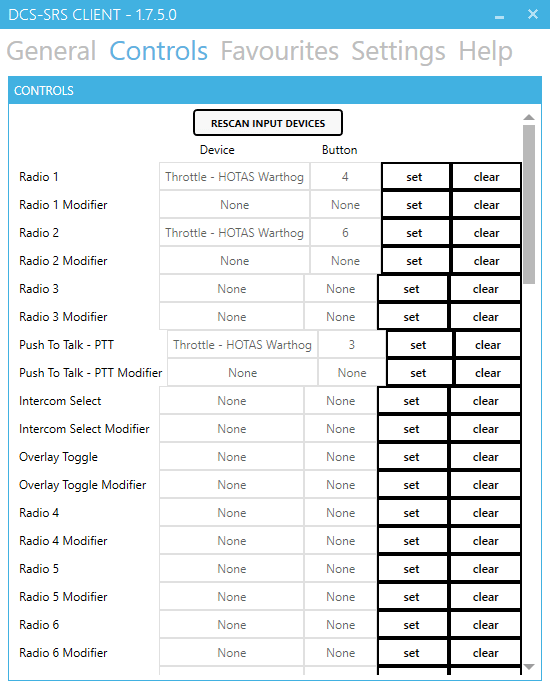

# Pas 8: Instal·lació del SRS

L'SRS és un pluguin per simular comunicacions de ràdio i veu. És totalment independent del TeamSpeak 3 o el Discord.

Per fer-lo servir és necessari instal·lar el programa a l'ordinador. Podeu baixar l'SRS [d'aquest enllaç](http://dcssimpleradio.com). Heu de seleccionar el EXE que trobareu a sota de tot.

***Teniu una guia actualitzada i oficial del programa sobre com instal·lar-ho i configurar-ho en [aquest enllaç](http://dcssimpleradio.com/gettingstarted/).***

## Primer pas

Un cop baixat l'EXE, feu doble clic i sobrirà una finestra com aquest.

{: .center}

En aquesta finestra, t'ha de detectar tot automàticament, i no cal tocar res.

* A **Step 1** és la carpeta on s'instal·larà el programa (no va dintre del DCS, és un programa extern).
* A **Step 2** és el lloc on trobarà les carpetes personalitzades del DCS, per defecte venen a *C:\Users\nom_d'usuari_windows\Saved Games*.
* Quan estigui tot correcte li doneu a Install / Update DCS-SRS.

## Configuració

Us expliquem les pestanyes principals a grans trets.

!!! danger "Ports"

    Els ports que heu d'obrir perquè funcioni són el 5002 i 5003.

### General

{: .center}

1. Aquí selecciona el teu micròfon.
2. Aquí selecciona els teus altaveus o auriculars.
3. Això no cal seleccionar res, és només per si vols sentir-te a tu mateixo parlant.
4. Aquí és on has de ficar la IP del servidor de l'SRS. A l'esquerra ho tens per posar-la manualment i a la dreta tens el llistat de servidors de SRS desats a Favorits. Per connectar és només donar-li a Connect.

### Controls

{: .center}

1. El botó per seleccionar la radio 1.
2. Si vols fer servir cap modificador pel botó de la radio 1, és com un Shift, un Pinky o un S3.
3. El botó per seleccionar la radio 2.
4. Si vols fer servir cap modificador pel botó de la radio 2.
5. El botó per parlar per la radio.
6. Si vols fer servir cap modificador pel botó de la radio.

El botó de selecció de radio et permet primer seleccionar quina radio vols fer servir per parlar. I despres apretes el botó per parlar (PTT).

!!! Note "Nota"
    L'SRS permet parlar per radio mentre apretes el botó de selecció de radio. Per fer-ho s'ha de seleccionar l'opció **Radio Switch works as Push To Talk (PTT)** a `Settings`.

### Paràmetres

Aquestes son algunes de les opcions de configuració, et recomanen que la resta les exploris tu mateix.

{: .center}

1. Habilita els efectes de radio quan és transmet (Tx) i que és rep (Rx), a l'inici i al final.
2. Habilita els efectes d'encriptació de les comunicacions.
3. Modifica la veu a les comunicacions.

!!! Tip "Consell"
    No cal tancar la partida per fer canvis a l'SRS.

Als servidors publics molts el tenen funcionant, i et pots connectar al seu servidor de SRS per sentir i parlar a les seves partides.

Ja queda poc.

[Següent pas >](/gn/pas9)
