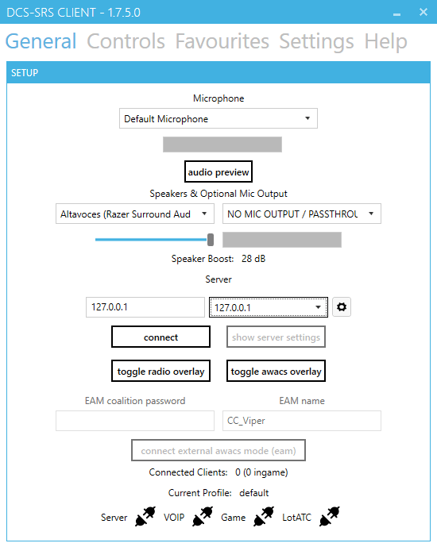
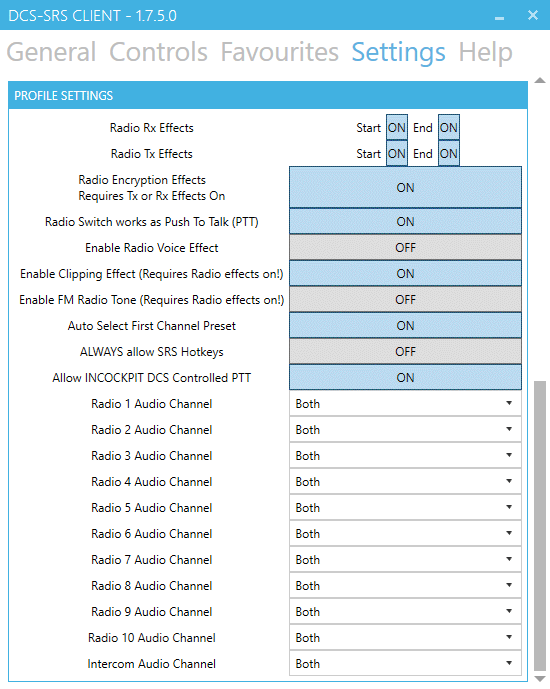

# Pas 8: Instal·lació del SRS

L'SRS és un pluguin per simular comunicacions de ràdio i veu. És totalment independent del TeamSpeak 3 o el Discord.

Per fer-ho servir és necessari instal·lar el programa a l'ordinador. Podeu baixar l'SRS [d'aquest enllaç](http://dcssimpleradio.com). Heu de seleccionar el EXE que trobareu a sota de tot.

***Teniu una guia actualitzada i oficial del programa sobre com instal·lar-ho i configurar-ho en [aquest enllaç](http://dcssimpleradio.com/gettingstarted/).***

## Primer pas

Un cop baixat l'EXE, feu doble clic i s'obrirà una finestra com aquesta.

{: .center}

En aquesta finestra, t'ha de detectar tot automàticament, i no cal tocar res.

* A **Step 1** és la carpeta on s'instal·larà el programa (no va dintre del DCS, és un programa extern).
* A **Step 2** és el lloc on trobarà les carpetes personalitzades del DCS, per defecte venen a *C:\Users\nom_d'usuari_windows\Saved Games*.
* Quan estigui tot correcte li doneu a `Install / Update DCS-SRS`.

## Configuració

Us expliquem les pestanyes principals a grans trets.

!!! danger "Ports"

    Els ports que heu d'obrir perquè funcioni són el 5002 i 5003.

### General

{: .center}

* A **Microphone** es selecciona el teu micròfon del desplegable.
* Al desplegable esquerra de **Speakers & Optional Mic Output** es selecciona els teus altaveus o auriculars.
* A **Server** és on has de ficar la IP del servidor de l'SRS. A l'esquerra ho tens per posar-la manualment i a la dreta tens el llistat de servidors de SRS desats a Favorits. Per connectar és només donar-li a `Connect`.

!!! Note "Nota"
    Si els tres endolls de color negre, es possen en verd un cop connectat al servidor del SRS i dintre de la partida, llavors vol dir que tot funciona correctament.

### Controls

{: .center}

* **Radio 1** És per seleccionar la radio 1.
* **Radio 1 Modifier** Si vols fer servir cap modificador pel botó de la radio 1, és com un Shift, un Pinky o un S3.
* **Radio 2** És per seleccionar la radio 2.
* **Radio 1 Modifier** Si vols fer servir cap modificador pel botó de la radio 2.
* **Push To Talk - PTT** El botó per parlar per la radio.
* **Push To Talk - PTT Modifier** Si vols fer servir cap modificador pel botó de la radio.

El botó de selecció de radio et permet primer seleccionar quina radio vols fer servir per parlar. I despres apretes el botó per parlar (PTT).

!!! Note "Nota"
    L'SRS permet parlar per radio mentre apretes el botó de selecció de radio. Per fer-ho s'ha de seleccionar l'opció **Radio Switch works as Push To Talk (PTT)** a `Settings`.

### Paràmetres

Aquestes son algunes de les opcions de configuració, et recomanen que la resta les exploris tu mateix.

{: .center}

* **Radio Rx Effects** i **Radio Tx Effects** habilita els efectes de radio quan és transmet (Tx) i que és rep (Rx), a l'inici i al final.
* **Radio Encryption Effects** Habilita els efectes d'encriptació de les comunicacions.
* **Enable Radio Voice Effect** Modifica la veu a les comunicacions.

!!! Tip "Consell"
    No cal tancar la partida per fer canvis a l'SRS.

Als servidors publics molts el tenen funcionant, i et pots connectar al seu servidor de SRS per sentir i parlar a les seves partides.

Ja queda poc.

[Següent pas >](/gn/pas9)
