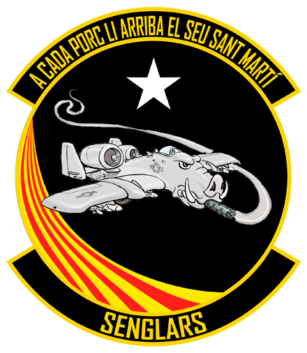

# **Sobre el grup DCS**

{: .center}

El **grup del DCS** és un dels grups que pertany a la comunitat Catalana de simulació **Cavallers del Cel**. Dintre del **DCS** és realitzen missions de combat posant en practica tàctiques i estratègies reals, amb un component de rol important per ajudar-nos a la immersió.

Per aconseguir completar les missions amb èxit, tenim un programa de cadets on impartim classes de manera regular per formar als nous membres.

Si voleu contactar amb nosaltres ho podeu fer:

  - Al nostre web [cavallersdelcel.cat](http://www.cavallersdelcel.cat)
  - Al [fòrum del grup DCS](http://www.cavallersdelcel.cat/forums/forums/digital-combat-simulator.16/)
  - Al nostre servidor de [Discord](https://discord.gg/4RGJdTv)